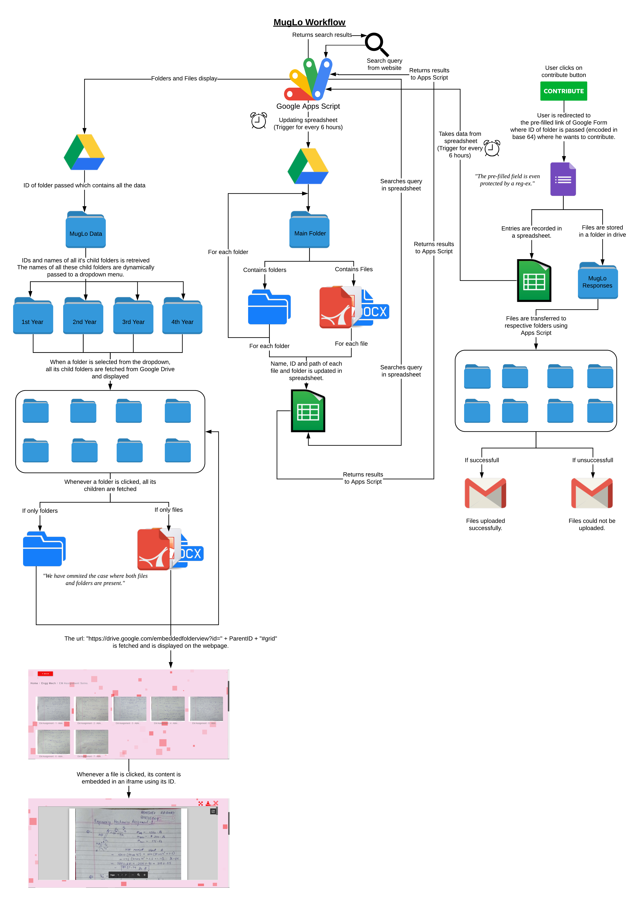

# muglo
#### A website for the students of IIT Jodhpur which serves as a platform for sharing notes

## Tech stack
Google Apps Script is used for the entire project. Google Apps Script allows us to use various services by Google like Google Drive, Google Spreadsheets, G-Mail etc. directly. All these advantages by Google Apps Script have been exploited. It even allows you to deploy the website in its own domain.

## Workflow

## Deployment
We can deploy the Google Apps Script project by copying these files into the project and embedding the deployed Google Apps Script on any webpage.
